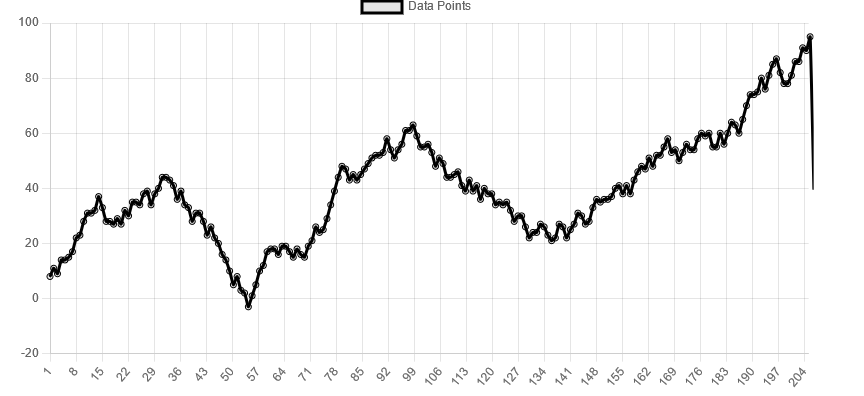
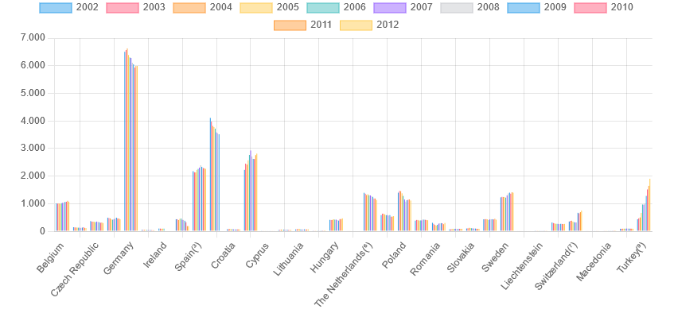
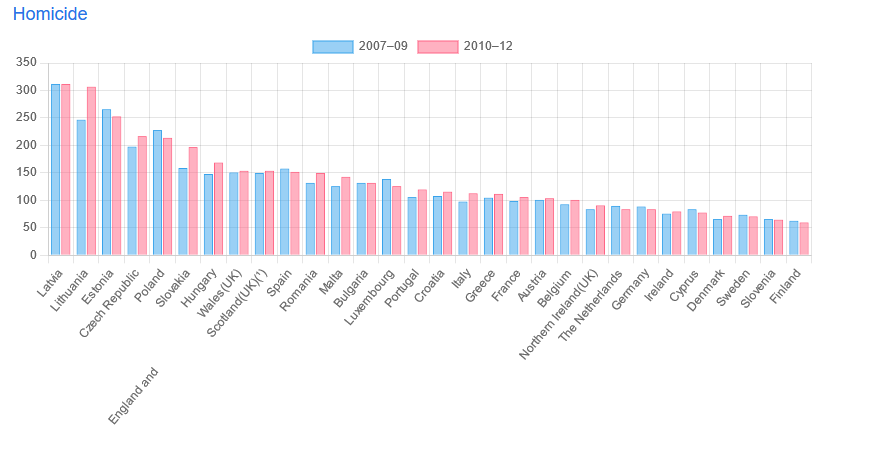
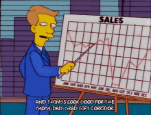

# 📊 JavaScript Challenge : "Data Visualisation"
## Description

Le projet Data Visualisation consiste à insérer 1 graphique de données distants et 2 graphiques de données  internes en Javascript sans ajout de balise dans le HTML. 

+ Graphique des données distants

Représente des données se trouvant à cette URL : [link](https://canvasjs.com/services/data/datapoints.php). Les données sont récupérer via AJAX et se rafraichit toutes les sécondes. Il se trouve en dessous du titre principale de l'article.

+ 2 Graphiques de données internes

Graphique du tableau 1

Graphique du tableau 2

Ils sont les représentations des données des tableaux 1 et 2 se trouvant sur la pages web. Ils ont insérées au-dessus de chacuns des tableauX.

Ces graphique n'apparaissent uniquement quand Javascript est activé.

## Technologie utilisé 

+ La bibliothèque ``Chart.js `` de Javascript
+ Technique ``AJAX``
+ API Javascript ``FETCH``
+ Forma de donnée en ``JSON``

